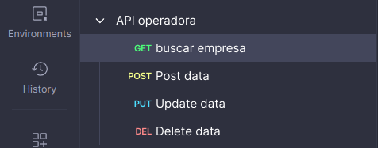
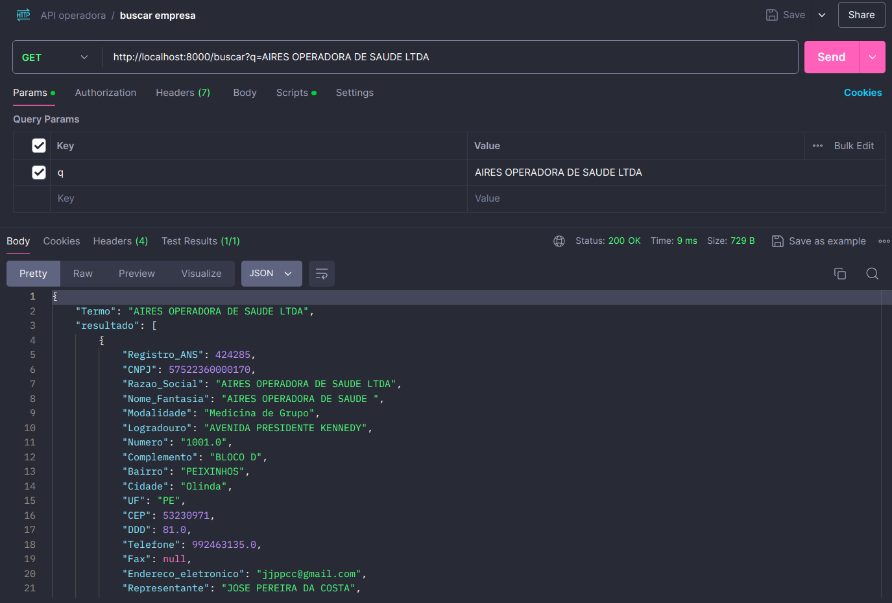
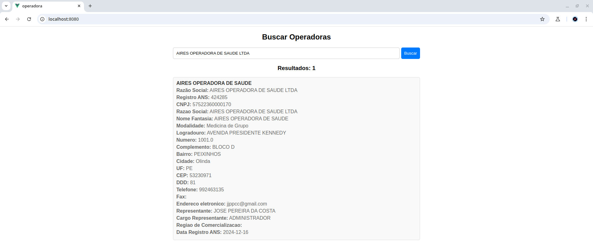

# 🌐 Teste de API (Frontend + Backend)

## 📝 Descrição
Desenvolvimento de interface web (Vue.js) com backend (Python) para consulta de operadoras de saúde, utilizando os dados preparados da planilha Relatorio_cadop utilizado do teste 3.

## 🎯 Objetivos
1. Criar API de busca textual em Python
2. Desenvolver interface Vue.js para consulta
3. Elaborar uma coleção no postman para o resultado

## Pré-requisito
- Python 3+
- Node js
- npm ou yarn

## Bibibliotecas python

- FastAPI:  Framework moderno e rápido para construção de APIs com Python
- fastapi.middleware.cors: Middleware para permitir ou restringir o acesso de origens diferentes em APIs
- pandas: manipula e analisa dados em tabelas.
- numpy: Biblioteca para computação científica em Python


## 📂 Estrutura do Projeto
```plaintext
/teste_api_vue.js/
├── backend/
│ ├── CSV                       # Pasta que contém a planilha CSV
│     ├── Relatorio_cadop.csv   # Dados do teste 3
│ ├── app.py                    # API FastAPI
│
├── frontend/
│ ├── operadora/
│   ├── src/
│     ├── Asserts/       #Pasta de imagens do projeto vue
│     ├── components/    #Pasta que contem os componentes
│     ├── App.vue/       #Arquivo principal do vue, aonde é carregado os componentes
│     ├── main.js/       #Arquivo JS


OS demais arquivos são de configurações do frameword vue.js
```

<br>

## Informações essencias do teste de API

o codigo está feito pra buscar o nome fantasia ou razão social, não está diferenciado lentra maiscula ou minuscula.

<br>

## ⚙ passo a passo pra rodar o teste API

Entre na pasta do teste_api_vuejs:

```bash
cd teste_api_vuejs
```

Entre na pasta backend:

```bash
cd backend
```

Comando para da o start na API:

```bash
uvicorn bash --reload
```

deverá aparecer:

```bash
INFO:     Uvicorn running on http://127.0.0.1:8000 (Press CTRL+C to quit)
INFO:     Started reloader process [270067] using WatchFiles
INFO:     Started server process [270069]
INFO:     Waiting for application startup.
INFO:     Application startup complete.
```

API estará rodando em http://localhost:8000.

O endpoint get disponivel da aplicação é "/buscar".

Modelo de como fazer a buscar da empresa pela a url:

```text
http://localhost:8000/?q=<nome da busca>
```

<br>

## ⚙ passo a passo pra rodar interface Vue js

Entre na pasta do teste_api_vuejs:

```bash
cd teste_api_vuejs
```

Entre na pasta front:

```bash
cd frontend
```

Entre na pasta operadora:

```bash
cd operadora
```

Digite o comando pra baixar as dependências necessarias do vue js

```bash
npm install
```

ou, se estiver usando Yarn:

```bash
yarn install
```

Inicie o servidor de desenvolvimento:

```bash
npm run dev
```
ou 

```bash
yarn dev
```

A aplicação será iniciada:

```bash

 DONE  Compiled successfully in 2559ms                                                                                                                                           01:36:09


  App running at:
  - Local:   http://localhost:8080/ 
  - Network: http://192.168.1.12:8080/

  Note that the development build is not optimized.
  To create a production build, run npm run build.

```

A aplicação estará disponível em http://localhost:8080

<br>

## Resultado API com Postman

Criando uma coleção pra fazer requição da API rest com o postman:

<p>
  
</p>

Estrutura de requição de teste:

```bash
http://localhost:8000/buscar?q=AIRES OPERADORA DE SAUDE LTDA
```
Resultado:

<p>
  
</p>

<br>

## Resultado integrando com o vue js

Acessando o localhost:8080 no navegador:

```bash
http://localhost:8080/
```

deverá aparecer a interface com o servido do vue js:

<p>
  
</p>

Fazendo a mesma busca passada com o nome "AIRES OPERADORA DE SAUDE LTDA", mas agora direto pela interface:

<p>
  
</p>

<br>

## Link pra volta pro README principal

| README | Descrição |
| --- | ------- |
| [README principal](../README.md) | voltar ao README principal |


