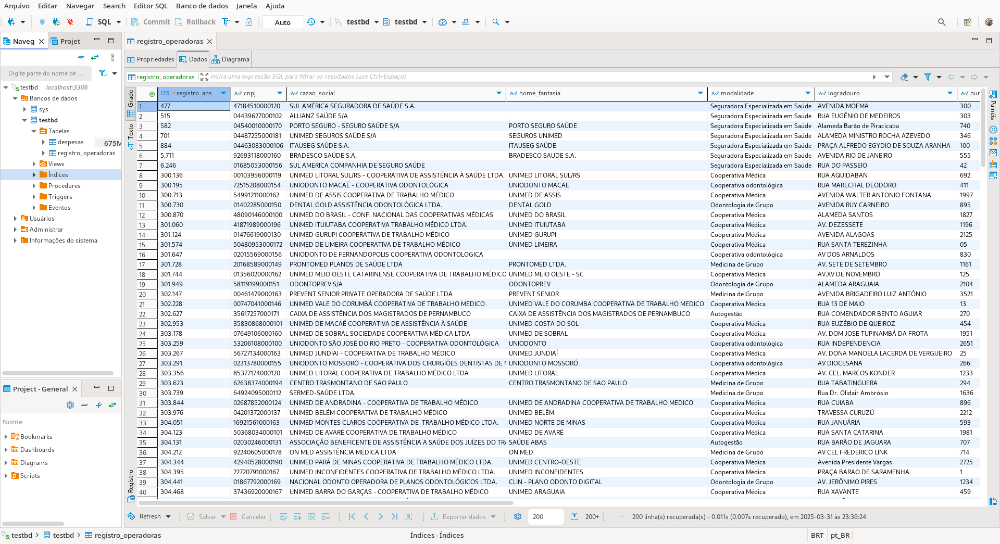
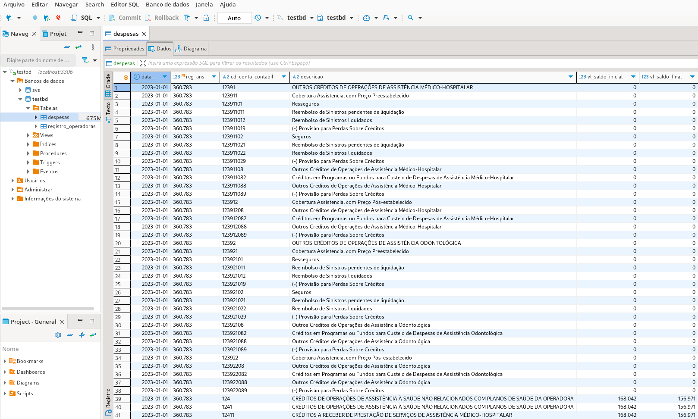
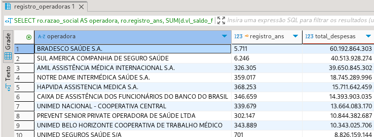
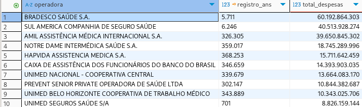

# 📊 Teste de banco de dados

## 📝 Descrição
Desenvolver queries SQL para estruturar e analisar dados financeiros de operadoras de planos de saúde a partir de arquivos disponibilizados pela ANS (Agência Nacional de Saúde Suplementar).

## 🎯 Objetivos
1. Extração de dados abertos da tabela Rol de Procedimentos e Eventos em Saúde do PDF do Anexo I do teste 1 da ANS
2. Modelagem de banco de dados.
3. Tranferencia de dados do Arquivo CSV para o banco de dados
3. Consultas estratégicas sobre despesas médico-hospitalares

## Pré-requisito
- Docker
- Docker-compose

## Informações essencias do teste de banco de dados

O teste de banco de dados foi desenvolvido utilizando as tecnologias Docker e Docker Compose.

O Docker é uma ferramenta utilizada para conteinerizar aplicações que o sistema venha a utilizar (neste caso, um banco relacional MySQL). Dessa forma, estamos executando o banco de dados dentro de um ambiente isolado.

O Docker Compose é utilizado neste projeto para definir as configurações do contêiner que executa o banco de dados. Ele foi automatizado e configurado para que, ao iniciar o build do Docker Compose, os dados da planilha estruturada em CSV sejam transferidos para o banco de dados de forma automática e organizada, respeitando os tipos de dados de cada coluna.

Os dados fica salvo nos volumes do docker, com isso os dados são persistentes com o container iniado ou não.

Isso resolve a transferência dos dados do CSV para o MySQL logo no início, de maneira automática.

A planilha CSV está incluída apenas como uma base para os dados que serão carregados no banco de dados.


## 📂 Estrutura de Arquivos
```plaintext
/teste_bd/
├── bd_script/
│   ├── 1T2023.csv              # Arquivo CSV
│   ├── 2T2023.csv              # Arquivo baixado
│   └── anexos.zip              # Pacote compactado
|   └── # outros arquivos CSVs    
│   ├── create_bd.sql           # script SQL pra criação da tabelas do banco de dados 
│   └── import.sql              # Script SQL pra importação do dados da planilha CSV para a tabelas do banco de dados
├── docker-compose.yml          # configuração do docker-compose
├── query_last_tri.sql          # Script de query pra buscar as 10 primeiras empresas com mais despases do ultimo trimestre
├── query_last_year.sql         # Script de query pra buscar as 10 primeiras empresas com mais despases do ultimo ano
├── README.md                   # Documentação do teste

```


## ⚙ passo a passo pra rodar o teste banco de dados

Entre na pasta transf_dados:

```bash
cd teste_bd
```

Execute o comando pra buildar e subir o docker-compose:

```bash
docker-compose up -d
```

Devera aparecer no terminal essas informaçãoes:

```bash
[+] Running 3/3
 ✔ Network teste_bd_default      Created                                                                                                      0.1s 
 ✔ Volume "teste_bd_mysql-data"  Created                                                                                                      0.0s 
 ✔ Container mysql_container     Started                                                                                                      1.2s 
```

Verifica se o contender foi iniciado corretamente:

```bash
docker ps
```

se ocorre tudo corretamente, deverá aparecer essa informações:

```bash
63257f80e869   mysql:5.7   "docker-entrypoint.s…"   2 minutes ago   Up 2 minutes   0.0.0.0:3306->3306/tcp, [::]:3306->3306/tcp, 33060/tcp   mysql_container
```

Essa informações indica que está iniciado o contender com o banco de dados

OBS: caso não subiu, rode esse comando:

```bash
docker start mysql_container
```

Isso dá o start do contender com o banco de dados.

### comando utils

caso queira parar o banco de dados, faça esse comando:

```bash
docker stop mysql_container
```
Isso irá pausar o contender do docker que contém o banco de dados!

Caso queira remover o build completo do docker-compose com os volumes e banco de dados, rode esse comando:

```bash
docker-compose down -v
```

Isso irá apagar todos os dados e configurações salvos do contender mysql_container (o que contem o nosso banco de dados)

```bash
[+] Running 3/3
 ✔ Container mysql_container   Removed                                                                                                        0.0s 
 ✔ Volume teste_bd_mysql-data  Removed                                                                                                        0.1s 
 ✔ Network teste_bd_default    Removed                                                                                                        0.1s 
```


### Acesso a bando de dados:

Uma vez o contender docker com o banco de dados estando ativo, temos acesso a ele.

Pode utilizar qualquer aplicação de administração de banco de dados que permita visualiza os dados, no meu caso eu usei o BDeaver.

Informções de acesso do banco de dados:

```text
Porta: 3306
Nome do banco de dados: testbd
User: user
Root password: rootpassword
User password: userpassword
```

### Resultado:

A partir do momento que o docker-compose foi ativado, os dados passarão para da planilha de __Relatorio_cadop.csv__ para a tabela __registro_operadoras__ do banco de de dados.

OBS: utilizeio BDeaver para a visualização das tabelas do banco de dados:

<p>
  
</p>


As planilhas CSVs com os resultados da despesas também foram tranferida para a tabela __despesas__  do banco de dados

<p>
  
</p>

<br>

Tabelas devidamente populadas, vamos ao resultados da query:

1. Query para pegar a 10 primeiras empresas com mais gasto no ultimo tri:

```SQL
SELECT 
    ro.razao_social AS operadora, 
    ro.registro_ans,
    SUM(d.vl_saldo_final - d.vl_saldo_inicial) AS total_despesas
FROM 
    despesas d
JOIN
    registro_operadoras ro ON d.reg_ans = ro.registro_ans
WHERE
    TRIM(d.descricao) = 'EVENTOS/ SINISTROS CONHECIDOS OU AVISADOS  DE ASSISTÊNCIA A SAÚDE MEDICO HOSPITALAR '
    AND DATE_SUB("2024-12-31", INTERVAL 3 MONTH )
GROUP BY 
    ro.razao_social, ro.registro_ans
ORDER BY
    total_despesas DESC
LIMIT 10;
```

Resultado da query:

<p>
  
</p>

<br>

2. Query para pegar a 10 primeiras empresas com mais gasto no ultimo ano:

```SQL
SELECT 
    ro.razao_social AS operadora, 
    ro.registro_ans,
    SUM(d.vl_saldo_final - d.vl_saldo_inicial) AS total_despesas
FROM 
    despesas d
JOIN
    registro_operadoras ro ON d.reg_ans = ro.registro_ans
WHERE
    TRIM(d.descricao) = 'EVENTOS/ SINISTROS CONHECIDOS OU AVISADOS  DE ASSISTÊNCIA A SAÚDE MEDICO HOSPITALAR '
    AND DATE_SUB("2024-12-31", INTERVAL 1 YEAR )
GROUP BY 
    ro.razao_social, ro.registro_ans
ORDER BY
    total_despesas DESC
LIMIT 10;
```

Resultado da query:

<p>
  
</p>

<br>

## Link pra volta pro README principal

| README | Descrição |
| --- | ------- |
| [README principal](../README.md) | voltar ao README principal |


