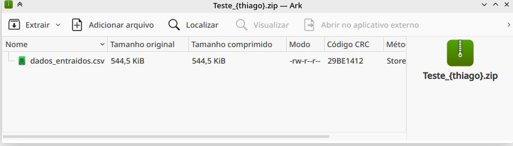
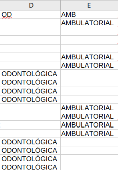

# 📊 Teste de Transformação de Dados

## 📝 Descrição
Conversão estruturada de dados do PDF "Anexo I" (Rol de Procedimentos em Saúde) para CSV formatado, com tratamento de abreviações e compactação.

## 🎯 Objetivos
1. Extrair tabelas do PDF (todas as páginas)
2. Converter para CSV estruturado
3. Substituir abreviações (OD → Odontológico, AMB → Ambulatorial)
4. Compactar em `Teste_{Nome}.zip`

## Pré-requisito
- Python 3+

## Bibibliotecas python

- tabula: extrai tabelas de arquivos PDF.
- pandas: manipula e analisa dados em tabelas.
- zipfile: compacta e descompacta arquivos ZIP.
- os: gerencia arquivos e diretórios do sistema.
- re: trabalha com expressões regulares.

## 📂 Estrutura de Arquivos
```plaintext
/transf_dados/
├── __pycache__          
├── dados_entraidos.csv  # arquivo com csv extraido
├── main.py              # Script principal executavel
├── README.md            # Documentação do teste
├── Teste_{thiago}.zip   # Zip com os PDF compactas
├── trans_dados.py       # Scripts com a funções necessarias

```

## ⚙ passo a passo pra rodar o teste transferencia de dados

Entre na pasta transf_dados:

```bash
cd transf_dados/
```

Execute o arquivo main.py

```bash
python main.py
```

### Resultado:

```bash
Dados de PDF extraindo para tabela estruturada em csv

Arquivo zip criado: Teste_{thiago}.zip
```

Arquivo __Teste_{thiago}.zip é criado

<p>
  
</p>

Abreviações trocadas:

<p>
  
</p>

<br>

## Link pra volta pro README principal

| README | Descrição |
| --- | ------- |
| [README principal](../README.md) | voltar ao README principal |
