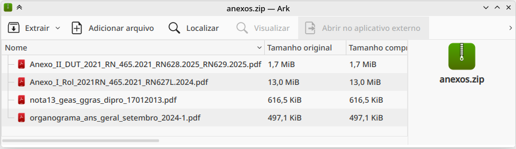

# Teste de WebScraping

## 📝 Descrição
Desafio técnico para extração automatizada de arquivos PDF do portal da ANS (Agência Nacional de Saúde Suplementar).

Url alvo: [https://www.gov.br/ans/pt-br/acesso-a-informacao/participacao-da-sociedade/atualizacao-do-rol-de-procedimentos](https://www.gov.br/ans/pt-br/acesso-a-informacao/participacao-da-sociedade/atualizacao-do-rol-de-procedimentos)


## 🎯 Objetivos
1. Acessar o site da ANS
2. Baixar os Anexos I e II em PDF
3. Compactar os arquivos em um único pacote


## Pré-requisitos
- Python

## Bibibliotecas python

- os: manipula arquivos, diretórios e variáveis do sistema operacional
- request: faz requisições HTTP.
- urljoin: une partes de URLs de forma segura.
- zipfile: lida com arquivos ZIP

## 📂 Estrutura de Arquivos
```plaintext
/webscraping/
├── __pycache__          
├── downloadsPdf         # Pasta do PDFs baixados
├── anexos.zip           # Zip com os PDFs compactas
├── main.py              # Script principal executavel
├── README.md            # Documentação da pasta
├── web_scraping.py      # Scripts com a funções necessarias
```

## ⚙ passo a passo pra rodar o script

Entre na pasta webScraping:

```bash
cd webscraping/
```

Execute o arquivo main.py

```bash
python main.py
```

O resultado:

```bash
Baixando: downloadsPdf/organograma_ans_geral_setembro_2024-1.pdf
Baixando: downloadsPdf/Anexo_I_Rol_2021RN_465.2021_RN627L.2024.pdf
Baixando: downloadsPdf/Anexo_II_DUT_2021_RN_465.2021_RN628.2025_RN629.2025.pdf
Baixando: downloadsPdf/nota13_geas_ggras_dipro_17012013.pdf
Baixando: downloadsPdf/organograma_ans_geral_setembro_2024-1.pdf
```

E logo em seguida os PDFs é compactado como ZIP

<p>
  
</p>